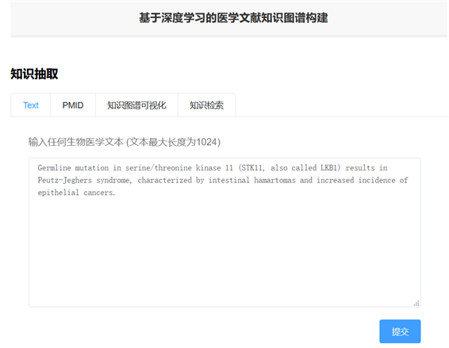
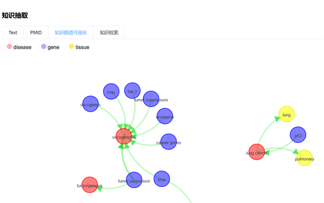
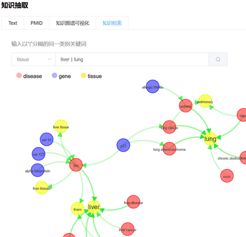
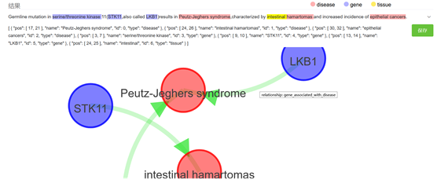

# Medical_KGBuild
## 基于深度学习的医学知识图谱构建

演示：


### Model

主要存放BioBERT预训练模型，以及crf命名实体识别，远程监督关系抽取模型。

医学领域远程监督数据对齐：https://github.com/DevilExileSu/UMLS-MetaMap-Aligned
```bash
Flask                1.1.1 
Flask-Cors           3.0.8
numpy                1.17.4
torch                1.8.0
tqdm                 4.56.0
```

### Server
存放Web服务端代码，基于Spring Boot，使用Neo4j图数据库。


### Web
存放Web前端，基于Vue.js，使用Element Plus作为组件UI库，D3.js作为知识图谱可视化库











